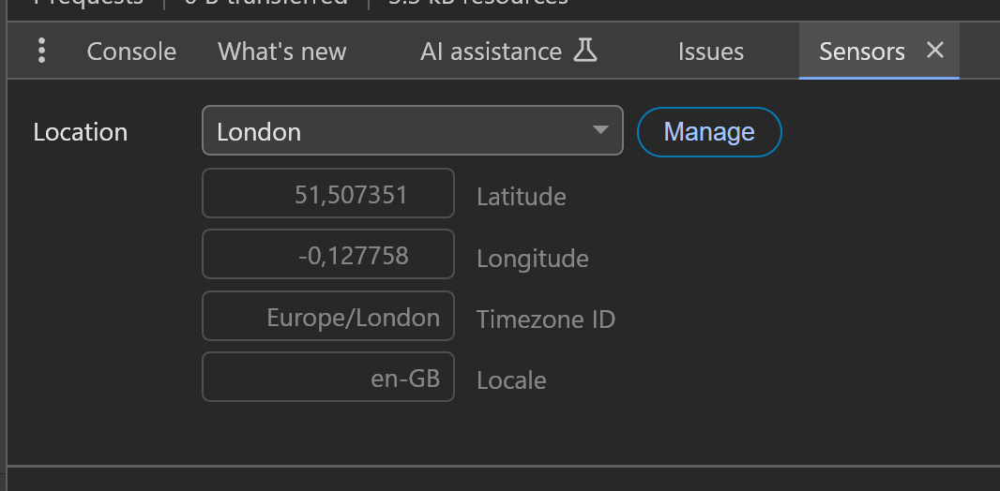
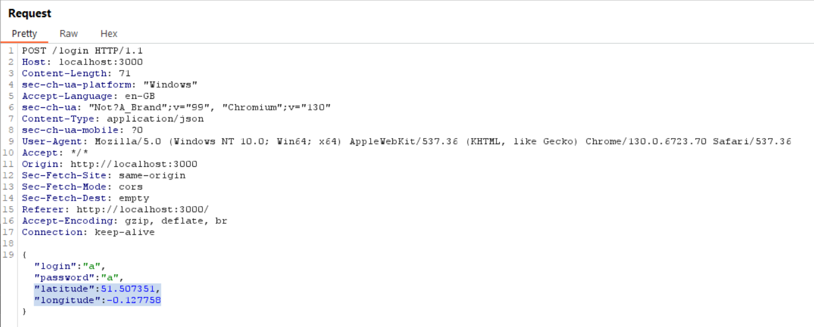

# Ministry of magic vault
(nazwa może byc zmieniona)

1. Po wpisaniu losowych danych do logowania pojawi sie zatępujący komunikat:
`We only accept corrspondency in out office in London`
Aby obejść to zabezpieczenie należy ustawić w przeglądarce lokalizację na Londyn
lub dowolną z zakresu
`latitude 51 -- 52`
`longtitude -0.13 -- -0.12`
 
Najłatwiej to zrobić poprzez załadkę "sensors" w Google Chrome, ale dane o lokalizacji sa przesyłene w zapytaniu POST, więc tak też można je zmodyfikować

2. Po pokonaniu poprzedniego zabezpieczenia i ponowanym wpisaniu losowych danych wyświetli sie nastepująca wiadomość:
`We only accept requests delivered by owls`
Należy zmienić wartosc nagłówka zapytania `User-Agent` na `Owl` lub `owl`

3. Kolejny błąd:
`We demand thy correspondence be written in proper british English`
Należy ustawić wartośc nagłówka `Accept_Language` na `en-GB`
 
Jeżeli użyło się przeglądarki chrome do ustawienia lokalizacju ten nagłówek będzie usatawiony automatycznie

4. Kolejny błąd:
`Invalid login credentials`
Po wejściu na podstrone /robots.txt wyswietli sie ścieżka /passes.txt
Na niej widać następujące dane logowania
`hpotter@mmin.gov.uk`
`3d2QGYu2V8DLo)HhyHmzEQzWaoH`