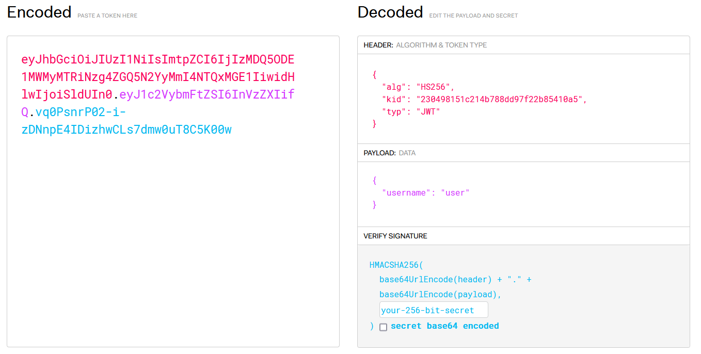
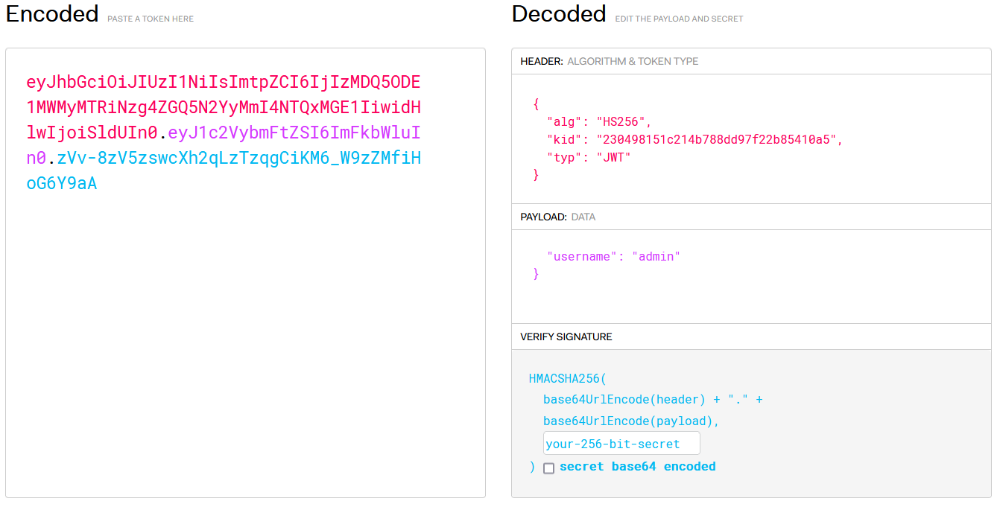

1. Register on the site a log in into you account
2. Use dev tools in browser on a proxy (e.g. BurpSuite) to get session cookie
3. Change the session cookie value to assing yourself administrator priviliges (e.g. change user value to "admin"). You can use `https://jwt.io/` or make a python script

4. Inject the modified cookie into the browser
5. Go to /admin site and retrieve the flag